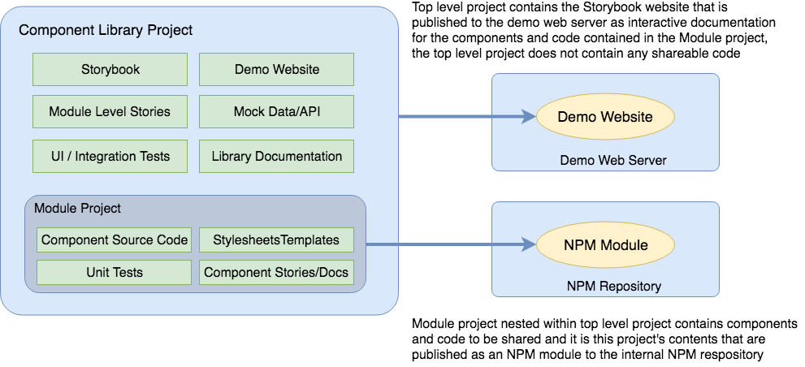

# Common Component Library

This project contains the source code for the Common Component NPM library [`@imaginecom/common-component-lib`](http://npm.xgproduct.com:4873/#/detail/@imaginecom/common-component-lib) and the configuration needed to publish this library to the internal [Imagine Communications NPM repository](http://npm.xgproduct.com:4873).

Also contained in the project is a [Storybook](https://storybook.js.org/) demo website that documents and demonstrates the use of the components in the NPM library.

The components published in the `@imaginecom/common-component-lib` library consist of core components used across UI projects, independent of the requirements of any one project.

These include:

(todo, list components as they are added)

This project contains Unit and UI tests for the component it contains.

## Links

[Published NPM Module in Repository](http://npm.xgproduct.com:4873/#/detail/@imaginecom/common-component-lib) : Contains useful information about NPM repository scope.

[Creating a Library with Angular CLI](https://blog.angularindepth.com/creating-a-library-in-angular-6-87799552e7e5) :
Good article describing how to create an Angular project for publishing an NPM Module, includes useful descriptions of how things are wired between the projects.

## Installation

After checking this project out locally there are two steps that are required before building or [running the project](#markdown-header-running-storybook-locally).

First, the needed dependencies must be installed from NPM:

```
npm install
```

Second, after the NPM install completes the inner NPM module project must be built at least once with the following command:

```
npm run package
```

This will cause the inner NPM module project to build allowing the outer Storybook website to resolve any dependencies from the inner project.

Without performing this second step, you may encounter an error that looks like the following when attempting to build the root project or run the Storybook website locally:

```
ERROR in /Users/jim/projects/temp/xg-common-components/src/app/app.module.ts
ERROR in /Users/jim/projects/temp/xg-common-components/src/app/app.module.ts(5,44):
TS2307: Cannot find module 'common-component-lib'.
```

For a more thorough description of the inner and outer projects, see [Working with the Project](#markdown-header-working-with-the-project), for details on resolving imports from the Storybook site to the module project see [Resolving Imports from the NPM Module Project](#markdown-header-resolving-imports-from-the-npm-module-project).

## Installing the NPM Module

The NPM library module is published to the internal Imagine Communications NPM repository at:

http://npm.xgproduct.com:4873/#/detail/@imaginecom/common-component-lib

See the NPM module documentation for instructions on installing and using the module in another project.

## Working with the Project

This project consists of an NPM library project containing reusable components that can be published to an NPM repository, along with a Storybook website project that demonstrates the components contained in the NPM library.

The project is structured so that the top level project contains the Storybook website, and an inner project in the `~/projects/` subdirectory contains the components and code published as the NPM module:



Both the Storybook website project and the NPM module project have their own `package.json` files, which declare the dependencies needed for each.

The versioning in the separate `package.json` files must be kept in sync to ensure that the published Storybook demonstration website version and the NPM module that it demonstrates are the same.

The Storybook website is configured to pick up any files named with the extension `*.stories.ts` that are contained in either the `~/projects/*` or `~/src/app` directories, and to add them automatically to the resulting Storybook website. Files under `~/src/app` are sorted first in the Storybook website left navigation bar, as this is where project-wide documentation should be placed. See [~/.storybook/config.js](/.storybook/config.js) for how this is accomplished.

#### Resolving Imports from the NPM Module Project

The components published in the inner NPM module project can be directly accessed from the outer Storybook project, without publishing and importing to an NPM repository.

Using this approach, the outer Storybook project can import without specifying an NPM scope or using a relative file path:

```
import { SampleComponent } from 'sample-lib';
```

Where `SampleComponent` is a component that is exported from the NPM module package `~/projects/sample-lib`.

### Adding Items to the NPM Module Project

Components, services, pipes, etc, that will be published with the NPM module must be added to the internal module project and not to the top level documentation project.

To do this, use the `ng generate` command, but specify the internal module project using the `--project` flag. So if the internal module project is named `sample-lib` (this would be the directory under `~/projects/`), the command below will add a component to that project and configure the component in the NPM project's module file as needed:

```
ng generate component SampleComponent --project=sample-lib
```

The `ng generate` sub commands for `service`, `pipe`, `interface` and others, accept the `project` flag as well. See the documentation for clarification: https://angular.io/cli/generate.

To ensure all items in the library are properly isolated with their associated source code, readme's and story files, include `--flat=false` when generating items other than components (this is the default for components), to ensure they are placed in their own subdirectory.

For instance, the command:

```
ng generate service SampleService --project=sample-lib --flat=false
```

This will generate the files:

```
CREATE projects/sample-lib/src/lib/sample-service/sample-service.service.spec.ts (369 bytes)
CREATE projects/sample-lib/src/lib/sample-service/sample-service.service.ts (142 bytes)
```

Nesting the new files within a subdirectory.

Then `README.md` and `sample-service.service.stories.ts` files can be added to the subdirectory as needed to include the service into the Storybook.

## Storybook

This project generates a Storybook website containing documentation for, and examples of, the components published to NPM by nested module project.

### Running Storybook Locally

Clone the project locally:

```
git clone https://bitbucket.org/imaginecommunications/xg-common-components.git
```

Install the dependencies:

```
npm install
```

Run the Storybook locally using the development server:

```
npm run storybook
```

To build a static version of the Storybook website:

```
npm run build-storybook
```

The static Storybook site will be built into the directory `~/storybook-static`.
